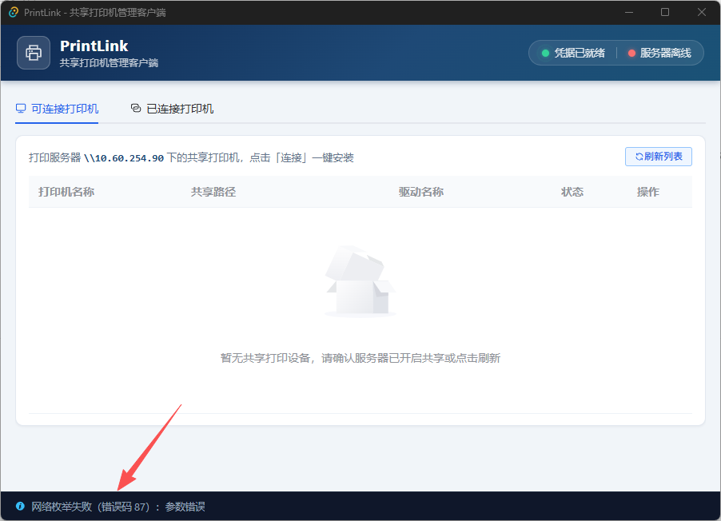

<div align="center">

# 🖨️ PrintLink

**共享打印机自动连接客户端**

一键写入凭据 · 自动扫描 · 静默连接 · 托盘驻留

[](https://github.com/YanGLweI/PrintLink/releases/latest)
[](https://github.com/YanGLweI/PrintLink/releases)


</div>

---

## 📖 项目简介

**PrintLink** 是一款面向企业内网终端的 **SMB 共享打印机自动连接桌面客户端**。

在企业内网环境中，员工要使用共享打印机，往往需要手动完成一套繁琐流程：打开凭据管理器 → 添加 Windows 网络凭据 → 输入打印服务器账号密码 → 手动搜索并添加共享打印机。整个过程对非技术人员极不友好，且每台新电脑都要重复一遍。

PrintLink 将这一切自动化：**启动即就绪**。程序启动时静默写入打印服务器凭据，自动扫描服务器下的所有共享打印机，用户只需点一下「连接」，打印机便安装完成。关闭窗口时程序最小化到系统托盘后台驻留，随时待命。

### 解决的痛点

| 传统方式 | PrintLink |
|----------|-----------|
| 手动打开凭据管理器添加凭据 | 启动时自动静默写入 |
| 手动输入服务器地址搜索打印机 | 自动扫描 `\\10.60.254.90` 共享列表 |
| 逐个手动添加打印机连接 | 一键连接安装 |
| 忘记凭据 / 凭据过期需重新配置 | 每次启动自动覆盖更新 |
| 配置完即退出，无法快速管理 | 托盘驻留，随时查看与管理 |

---

## 📥 下载安装

> **终端用户无需编译环境**，直接下载安装包即可使用。

<div align="center">

### [⬇️ 下载最新版本（GitHub Releases）](https://github.com/YanGLweI/PrintLink/releases/latest)

当前版本 **v1.0.1** · 安装包仅 ~3.8 MB · Windows 10/11 x64

</div>

| 步骤 | 说明 |
|------|------|
| **1. 下载** | 在 Release 页面下载 `PrintLink_x.x.x_x64-setup.exe` 安装包 |
| **2. 安装** | 双击运行，按向导完成（当前用户级别，**无需管理员权限**） |
| **3. 使用** | 启动即就绪 —— 自动写入凭据、自动扫描共享打印机，点一下「连接」即可 |

> 💡 安装包已内嵌 WebView2 引导程序，若系统缺少 WebView2 运行时会自动安装，无需额外配置。

---

## ✨ 核心功能

- **🔐 凭据自动写入** — 启动时静默写入打印服务器 SMB 凭据（`10.60.254.90 / print`），存在则覆盖、不存在则新建，幂等安全
- **🔍 共享打印机扫描** — 自动枚举打印服务器下所有共享打印机，双引擎探测（`EnumPrintersW` + `WNet` 回退），并预检 TCP 445 端口连通性
- **⚡ 一键连接安装** — 点击「连接」即可安装网络打印机，自动拦截重复连接，驱动缺失时给出中文提示
- **📑 双 Tab 管理** — 「可连接打印机」与「已连接打印机」分页管理，状态一目了然
- **🛠️ 设备全生命周期操作** — 已连接设备支持：打开属性、打开首选项、设为默认打印机、断开连接
- **🗂️ 系统托盘驻留** — 关闭窗口时最小化到任务栏右下角通知区域（类似微信），后台常驻；托盘菜单支持显示窗口 / 刷新列表 / 退出
- **📝 全局日志** — 所有操作与异常写入 `%APPDATA%/PrintLink/logs/`，便于排查
- **🛡️ 友好异常处理** — 全链路中文错误提示，网络不通、凭据失败、驱动缺失等场景均有明确指引

---

## 🖼️ 界面预览

<div align="center">



*主界面：状态指示灯 + 双 Tab 打印机管理 + 底部实时日志栏*

</div>

**界面布局说明**

```
+====================================================================+
|  [Logo] PrintLink - 共享打印机管理客户端      [凭据●] [服务器●]      |
+--------------------------------------------------------------------+
|  [ 可连接打印机 ]  [ 已连接打印机 (n) ]                              |
+--------------------------------------------------------------------+
|  [刷新列表]                                                          |
|  +----------------------------------------------------------------+ |
|  | 打印机名称  | 共享路径            | 驱动名称  | 状态 | 操作    | |
|  | HP-M4      | \\10.60..\HP-M4     | HP UPD   | 空闲 | [连接]  | |
|  +----------------------------------------------------------------+ |
+--------------------------------------------------------------------+
|  [i] 已发现 3 台共享打印机                                           |
+====================================================================+
```

---

## 🧱 技术栈

| 层级 | 技术 | 说明 |
|------|------|------|
| 桌面框架 | **Tauri 2.0** | 轻量级跨平台框架，产物体积小，启用 `tray-icon` 托盘特性 |
| 后端 | **Rust** + `windows-rs 0.58` | 直接调用 Win32 API（WinCred / WinSpool / WNet / Shell） |
| 前端 | **Vue 3.5** + TypeScript + Vite 6 | Composition API + `<script setup>` |
| UI 组件库 | **Element Plus 2.14** | 全量导入 + 全局图标注册 |
| 日志 | `simplelog` + `log` | 文件日志持久化 |
| 打包 | **NSIS** | 单安装程序，WebView2 嵌入式引导 |

**关键 Windows API**

| API | 用途 |
|-----|------|
| `CredWriteW` / `CredReadW` | 凭据写入 / 读回验证 |
| `EnumPrintersW` | 枚举共享打印机 / 本地已连接打印机 |
| `AddPrinterConnectionW` | 连接网络打印机 |
| `SetDefaultPrinterW` / `GetDefaultPrinterW` | 设置 / 读取默认打印机 |
| `OpenPrinterW` + `DeletePrinter` | 断开（删除）打印机 |
| `WNetOpenEnumW` / `WNetEnumResourceW` | 网络资源枚举（回退方案） |
| `ShellExecuteW` | 调起 `rundll32 printui.dll` 打开属性 / 首选项 |

---

## 🚀 快速开始

> 以下内容面向**开发者**（从源码构建）。仅需使用软件的终端用户请查阅上方[「下载安装」](#-下载安装)。

### 环境要求

| 依赖 | 版本要求 | 说明 |
|------|----------|------|
| **Node.js** | ≥ 18 | 前端构建 |
| **Rust** | ≥ 1.75（stable） | 后端编译 |
| **Visual Studio Build Tools 2022** | 含 "C++ 桌面开发" 工作负载 | 提供 MSVC `link.exe` 链接器 |
| **操作系统** | Windows 10 / 11 | 仅支持 Windows |

> ⚠️ **重要**：Rust 在 Windows 上默认使用 MSVC 工具链，必须安装 VS Build Tools 并加载 `vcvars64.bat` 环境，否则编译会报 `linker 'link.exe' not found`。

### 1. 克隆项目

```bash
git clone https://github.com/YanGLweI/PrintLink.git
cd PrintLink
```

### 2. 安装前端依赖

```bash
npm install
```

### 3. 配置 MSVC 编译环境

项目根目录已提供 `build-env.ps1` 脚本，用于在当前 PowerShell 会话中加载 MSVC 环境：

```powershell
# 在 PowerShell 中执行（dot-source 方式，使环境变量生效于当前会话）
. .\build-env.ps1
```

> 脚本会自动定位 `vcvars64.bat` 并将其导出的环境变量注入当前会话。若 Build Tools 安装路径不同，请修改脚本首行 `$vcvars` 变量。

### 4. 开发模式运行

```powershell
# 确保已加载 MSVC 环境
. .\build-env.ps1

# 启动 Tauri 开发模式（前端热重载 + Rust 自动重编译）
npm run tauri dev
```

应用窗口启动后会自动：写入凭据 → 探测服务器 → 扫描共享打印机列表。

### 5. 构建发布版

```powershell
. .\build-env.ps1
npm run tauri build
```

产物位于：

```
src-tauri/target/release/bundle/nsis/PrintLink_1.0.0_x64-setup.exe   # NSIS 安装程序
src-tauri/target/release/printlink.exe                                # 独立可执行文件
```

---

## 📁 项目结构

```
PrintLink/
├── src-tauri/                          # Rust 后端
│   ├── src/
│   │   ├── main.rs                     # 程序入口（release 隐藏控制台）
│   │   ├── lib.rs                      # 模块导出 + 9 个指令注册 + 关闭拦截
│   │   ├── credential.rs               # 凭据管理（CredWriteW，含单元测试）
│   │   ├── smb_scan.rs                 # SMB 共享打印机扫描（双引擎，含单元测试）
│   │   ├── printer_api.rs              # 打印机连接/默认/断开/属性操作（含单元测试）
│   │   ├── tray.rs                     # 系统托盘（菜单 + 单击恢复窗口）
│   │   └── utils.rs                    # 日志初始化 + 网络探测 + 错误码翻译（含单元测试）
│   ├── Cargo.toml                      # Rust 依赖与 windows crate features
│   ├── tauri.conf.json                 # 窗口 / 打包 / WebView2 配置
│   ├── capabilities/default.json       # Tauri 权限声明
│   └── icons/                          # 应用图标
├── src/                                # Vue3 前端
│   ├── main.ts                         # Element Plus 全量导入 + 图标全局注册
│   ├── App.vue                         # 主框架（状态栏 + Tabs + 日志栏 + 启动流程）
│   ├── components/
│   │   ├── StatusBar.vue               # 凭据 / 服务器状态指示灯
│   │   ├── AvailablePrinters.vue       # 「可连接打印机」Tab
│   │   └── ConnectedPrinters.vue       # 「已连接打印机」Tab
│   └── types/
│       └── printer.ts                  # TS 类型定义
├── docs/
│   └── screenshot.png                  # 界面截图
├── build-env.ps1                       # MSVC 编译环境加载脚本
├── index.html
├── package.json
├── vite.config.ts
└── tsconfig.json
```

---

## ⚙️ 配置说明

### 打印服务器参数

服务器地址、凭据等核心参数定义在 Rust 端，按需修改：

```rust
// src-tauri/src/utils.rs
pub const SERVER_ADDR: &str = "10.60.254.90";   // 打印服务器 IP
pub const SMB_PORT: u16 = 445;                  // SMB 端口
pub const NETWORK_TIMEOUT_SECS: u64 = 3;        // 网络探测超时

// src-tauri/src/credential.rs
pub const CRED_USERNAME: &str = "print";        // 凭据用户名
pub const CRED_PASSWORD: &str = "a*999999";     // 凭据密码
```

### 窗口与打包（tauri.conf.json）

| 配置项 | 值 | 说明 |
|--------|-----|------|
| `windows[0].width/height` | 900 × 620 | 固定窗口尺寸 |
| `windows[0].resizable` | `false` | 禁止缩放 |
| `bundle.targets` | `["nsis"]` | 仅产出 NSIS 安装包 |
| `bundle.windows.webviewInstallMode` | `embedBootstrapper` | 缺失 WebView2 时自动引导安装 |
| `bundle.windows.nsis.installMode` | `currentUser` | 当前用户级安装（无需管理员） |

---

## 🧪 测试

项目内置 17 个 Rust 单元测试，覆盖凭据、扫描、过滤、日志、网络等核心逻辑：

```powershell
. .\build-env.ps1
cd src-tauri
cargo test
```

| 模块 | 测试覆盖 |
|------|----------|
| `credential.rs` | 凭据写入 / 读回 / 幂等覆盖 / 不存在提示 |
| `smb_scan.rs` | 序列化 / 共享名提取 / 路径拼接 / 离线优雅降级 |
| `printer_api.rs` | 路径拼接 / 服务器前缀过滤 / 大小写不敏感 / 序列化 |
| `utils.rs` | 日志目录 / 网络超时 / 错误码翻译 / 地址格式 |

**质量门禁**（全部通过）：

```
cargo check        → 0 error, 0 warning
cargo clippy       → 0 warning
cargo test         → 17 passed, 0 failed
npx vue-tsc --noEmit → 0 error
npm run build      → 构建成功
```

---

## 🔧 常见问题

**Q: 编译报 `linker 'link.exe' not found`？**
A: 未加载 MSVC 环境。执行 `. .\build-env.ps1` 后再编译，或确认已安装 VS Build Tools 的 "C++ 桌面开发" 工作负载。

**Q: 提示「打印服务器网络不通」？**
A: 程序会先探测服务器 TCP 445 端口（3 秒超时）。请确认：① 已连接内网；② 服务器 SMB 服务正常；③ 防火墙未拦截 445 端口。

**Q: 提示「凭据验证失败」？**
A: 可能是与服务器已存在使用不同凭据的会话（错误码 1219）。重启程序，或在命令行执行 `net use * /delete` 清理现有会话后重试。

**Q: 连接打印机提示「驱动缺失」？**
A: 本地缺少该打印机驱动（错误码 1797/1930）。请先手动安装对应驱动，再回到 PrintLink 点击连接。

**Q: 日志在哪里查看？**
A: `%APPDATA%/PrintLink/logs/printlink.log`（即 `C:\Users\<用户名>\AppData\Roaming\PrintLink\logs\`）。

**Q: 如何彻底退出程序？**
A: 点击窗口右上角 × 只会最小化到托盘。右键托盘图标 → 「退出 PrintLink」即可完全退出。

---

## 📄 License

[MIT](LICENSE) © YLW

---

<div align="center">

**Developed by Yeunglw** · [GitHub 主页](https://yanglwei.github.io/)

</div>
